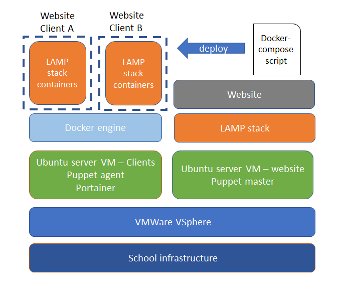

# Project hosting Team 6
## Shared hosting platform

Schema infrastructure:\


Schema Docker:\


## Prerequisites
For everything to work you'll need:
- Docker
- Docker-Compose
## Setup


You'll find everything you need under the _docker_ directory. There's two components you will use: The Nginx Reverse Proxy under the directory _nginx_ and the bash script _script.sh_. 

The reverse proxy needs to be started __once__ at first by going to its directory and using docker compose to build and run the docker container.

```bash
cd ./projecthosting/docker/nginx
docker-compose up -d
 ```

Then we give the bash script execute rights and run the script. For each new website, you just execute the script again.

```bash
cd ../
chmod +x ./script.sh
./script.sh
```

The script creates a whole directory for your website. It will be named something like __webXX__. 

In this folder you'll find another folder __www__ where your website should be stored, and __mysql__ where all sql data is stored.

The script will tell you the Virtual Host names of your site.

Everything should now be up and running!

To visit the website, you add the virtual host names together with the machine's ip to your hosts file. It will look someting like this:
```
192.168.0.XX web.milansterkenswebXX.teamsixhosting 
192.168.0.XX phpmyadmin.milansterkenswebXX.teamsixhosting
```


## Remove/Stop a website

first you shut down al associated docker containers by going to the site's folder and run:

```bash
docker-compose down
docker-compose rm -f
```
After shit you can delete the whole directory if you want.

### TODO
- add laravel functionality
